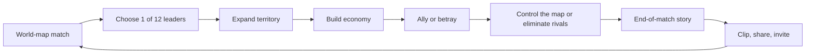
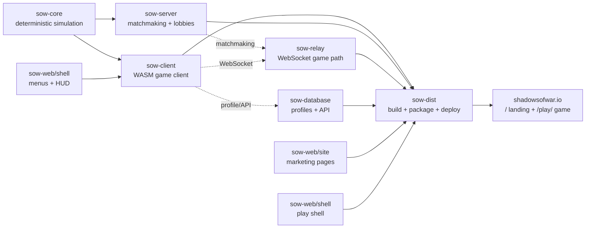
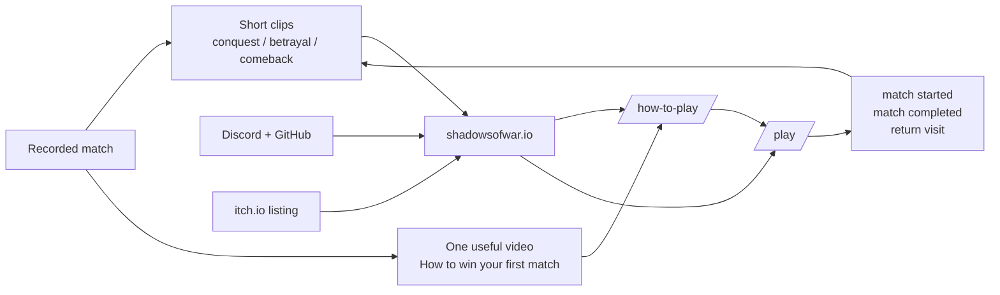

# Shadows of War — launch graph

Status: **shipping map**
Purpose: keep one product moving from code to a real player, without opening
another World of Unreal / Cosmicrafts / NFTropoly front before this loop is
measured.

This document separates facts found in the repository from working hypotheses.
It is the handoff map for the next work sessions.

## The product loop



The useful product promise is therefore:

> **A match-based browser MMORTS about territory, economy, alliances, and
> betrayal.**

`MMORTS` is the category. The story-producing verbs are the acquisition hook.

## The engineering graph



The important boundary is `sow-dist`: the marketing site and game shell do not
become public because their source files changed; they become public when the
official packaging and deployment path includes them.

## Current facts

| Node | Evidence | State |
|---|---|---|
| Positioning | `sow-web/site/index.html` | Landing now says browser MMORTS and uses `Play now`. |
| Onboarding | `sow-web/site/how-to-play/index.html` | Standalone route exists; it is not hidden under Guides. |
| Conversion path | `sow-web/site/index.html` | `/` → `/how-to-play/` or `/play/`; current site lists the browser build as live. |
| Roster | `sow-web/site/app.js` | Twelve leaders are wired into the landing page and leader selector. |
| Matchmaking | `sow-server/src/lobby.rs` | One rolling matchmaking lobby rotates through `FFA`, `Teams`, and `HumansVsNations`. |
| Maps | `sow-server/src/map_playlist.rs` | Weighted map playlists choose maps and avoid recent repeats. |
| Simulation | `sow-core/src/game_config.rs`, `sow-core/src/engine/` | Default mode is FFA; map-control threshold is 60%; elimination is also an end condition. |
| Distribution | `sow-dist/src/main.rs` | The package includes the root site, `/how-to-play/`, media, and `/play/`; sitemap includes the onboarding route. |
| External listings | `sow-web/site/index.html` | Other platform listings are explicitly not claimed as live. |
| Browser measurement | repository search across `sow-web/` | No browser conversion event instrumentation was found. Server logs exist, but they are not a funnel. |

## Verification snapshot — 2026-08-22

The current local package under `dist/web/` was checked against the source
contract:

- Required webroot files exist: landing, `/play/`, `/how-to-play/`, legal
  pages, `robots.txt`, `sitemap.xml`, `sow.svg`, and the packaged client pair.
- The sitemap includes `/how-to-play/`.
- The staged landing contains the MMORTS positioning, FAQ, `Play now`, and the
  accurate “other platform listings are not live yet” statement.
- The staged field manual is byte-identical to
  `sow-web/site/how-to-play/index.html`.
- The staged gameplay MP4 and session screenshot were byte-identical to their
  source files.
- HTML parsing, `cargo check -p sow-dist`, `cargo test -p sow-dist`, and
  `git diff --check` passed.

The public smoke test remains intentionally open. It requires a production
deployment through `./sow p`; source/package verification cannot prove that the
public origin is serving this release.

## Acquisition graph — working hypothesis

This is not presented as proven performance. It is the cheapest testable path
with the assets already available.



## Non-stop work queue

### P0 — release the current truth

1. Audit the release payload so unrelated dirty work cannot hitchhike into the
   deployment.
2. Run the official `./sow p` pipeline after explicit production approval. For
   Android/Play, use the separate `./sow a` pipeline only when the AAB is ready.
3. Verify the public root, `/how-to-play/`, `/play/`, static assets, and one
   real matchmaking entry path.

**Done when:** a new player can click `Play now`, load the client, see a
matchmaking option, and enter a match from the deployed site.

### P1 — turn the existing recording into distribution assets

Produce only three cuts first:

| Asset | Job | Destination |
|---|---|---|
| 45–60s landscape | Explain the match loop visually | YouTube, landing page |
| 15–30s vertical | Show one decisive moment | Shorts / Reels / TikTok |
| 20–40s strategy clip | Answer one beginner question | YouTube search, Discord |

Use one CTA everywhere: **Play now at shadowsofwar.io**. Do not use generic
“indie game” copy; name the category and the conflict.

### P1 — publish the minimum viable presence

1. Own site: source of truth.
2. itch.io: distribution surface for the browser build.
3. YouTube: searchable explanation plus short clips.
4. Discord: feedback and repeat-player home.
5. GitHub: credibility and open-source trail, not the primary acquisition
   channel.

Steam, Epic, Poki, and another CrazyGames submission are follow-up branches;
they should consume a tested build and a better evidence package, not become
the next distraction.

### P2 — add one measurement seam

Before buying ads or redesigning the site, measure this minimum funnel:

```text
landing visit → Play now click → game shell loaded → matchmaking joined
→ match started → match ended → returned within 7 days
```

If analytics are not added yet, use server-side counts and a small manual
launch log. The first useful question is not “how many visitors?” but “where
does a curious visitor stop?”

### P3 — improve only observed friction

Prioritize fixes in this order:

1. Cannot understand the game.
2. Cannot reach a match.
3. Cannot tell what to do in the first five minutes.
4. Match is technically playable but not worth sharing.
5. Visual polish and platform expansion.

## What is deliberately frozen

- No World of Unreal studio rebuild in this work cycle.
- No NFTropoly cleanup beyond preserving its IP and current domain.
- No Cosmicrafts marketing reset until SOW produces a distribution loop and
  reusable launch experience.
- No new framework, CMS, analytics vendor, or platform adapter just to feel
  productive.

## Next session entry point

The next productive command sequence is:

```text
release audit → explicit deploy approval → ./sow p → public smoke test
→ make three video cuts → publish itch.io + YouTube → record funnel signals
```

The graph is complete enough to guide execution. The next unknown is not
strategy; it is the first real player journey through the deployed build.
