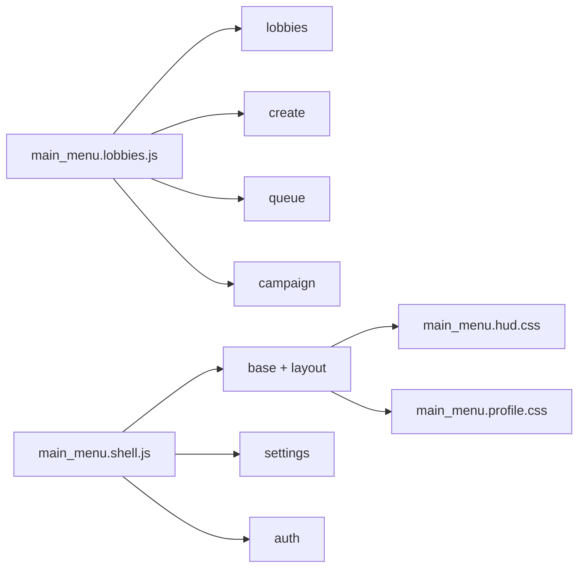

# Main menu CSS audit

## Ownership

| File | Owns | Does not own |
| --- | --- | --- |
| `main_menu.base.css` | Frame, shared controls, common fields, feedback, overlays, and modal primitives | Any screen-specific layout |
| `main_menu.layout.css` | Viewport, navigation rail, screen stage, scrolling, and shared responsive behavior | Create, queue, settings, auth, campaign, or lobby internals |
| `main_menu.lobbies.css` | Home/browser lobby cards, public list, join form, and search | Queue roster and custom-game form |
| `main_menu.create.css` | Custom game and solo-practice setup | Shared fields and buttons |
| `main_menu.queue.css` | Joined lobby/matchmaking room, map summary, countdown, roster, and host actions | Public lobby cards |
| `main_menu.settings.css` | Settings/account/sign-out modal | Auth modal |
| `main_menu.auth.css` | WouID email, OTP, and provider access modal | Settings/account preferences |
| `main_menu.campaign.css` | Campaign episode selector and its responsive layout | Tutorial runtime |
| `main_menu.hud.css` | In-game HUD | Main-menu screens |
| `main_menu.profile.css` | Heroes, store, and profile surfaces | Main-menu shared frame |

The sharing rule is simple: a selector stays in `base` when more than one screen renders it. A selector moves to a domain file only when its markup and behavior belong to one screen or one shared domain.

## Renderer graph



Campaign is a menu selector for episodes. Starting an episode remains in `main_menu.tutorial.js`; the tutorial runtime does not need to inherit campaign-only CSS.

## Cascade order

```text
sow-controls.css
main_menu.base.css
main_menu.layout.css
main_menu.lobbies.css
main_menu.create.css
main_menu.queue.css
main_menu.settings.css
main_menu.auth.css
main_menu.campaign.css
main_menu.hud.css
main_menu.profile.css
```

Shared rules load first. Domain rules load afterward so a screen can refine its own layout without copying shared controls or changing another screen.

## Hook audit

| Classification | Evidence | Decision |
| --- | --- | --- |
| `LIVE_STATIC` | Rendered class names in the shell and lobby renderers | Keep |
| `LIVE_DYNAMIC` | `sow-menu__mode-chip--` and `sow-auth__provider-icon--` are assembled in JavaScript | Keep and allowlist |
| `SHARED` | `sow-menu__form-field`, `sow-menu__field`, `sow-menu__modal-actions`, status, modal, and button primitives have multiple renderers | Keep in `base` |
| `DEAD` | The old `.sow-menu__queue` selector had no renderer hook; obsolete auth rules and unused variables were removed in the preceding audit | Delete |
| `UNKNOWN` | No selector is deleted only because a class is built dynamically or appears outside a single renderer | Leave for runtime evidence |

## Maintenance loop

1. Find the renderer and the actual hook before editing a selector.
2. Keep multi-screen primitives in `base`; move a complete single-domain block together.
3. Update this ownership table when a domain gains or loses markup.
4. Check the manifest and required-file list.
5. Run `./sow p` after Web/CSS changes.
6. Check home, browser, create, queue, settings, auth, and campaign on desktop and mobile before changing a shared rule.

## Checkpoints

- `C0`: audit reduced the base file from 2,998 to 2,957 lines and removed confirmed unused variables/rules plus the stale auth class hook.
- `C1`: current split creates eight focused menu files and removes the unhooked `.sow-menu__queue` rule.
- `C2`: `./sow p` passed; web, Poki, CrazyGames, public verification, and the inlined CSS order all passed. The listed screen checks remain the visual acceptance checklist.
